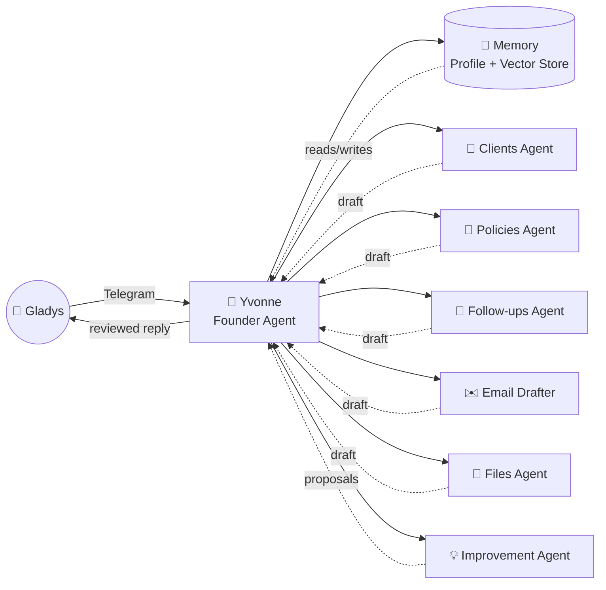
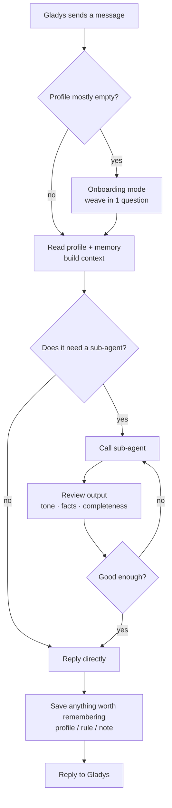
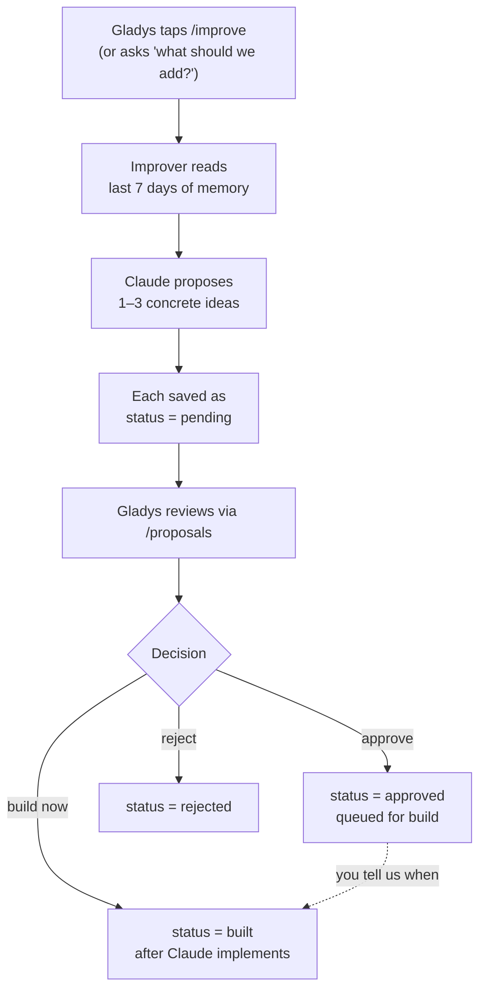
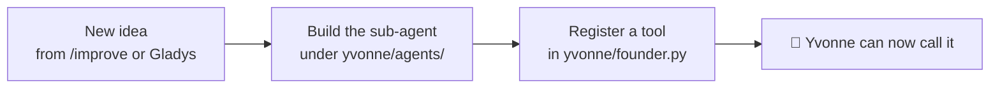

# Yvonne — Personal AI Assistant for Gladys

A quick walkthrough of how the assistant works, what's built today, and where
new things plug in. Nothing here runs without your say-so on improvements.

---

## 1. Big picture

You talk to **Yvonne** in Telegram. Yvonne is the only agent you ever speak
to. Behind her are five specialist sub-agents she delegates to. She reviews
their work before showing you anything.

**Key rule:** every sub-agent output passes through Yvonne first. She
sanity-checks tone, accuracy, and completeness before you see it.

---

## 2. What happens on every message

**What gets remembered automatically:**
- Stable facts (her company, products, work style) → profile
- Hard rules ("never quote without confirming the schedule") → rules list
- One-off context worth recalling later (preferences, decisions, client
  quirks) → vector store for semantic search

---

## 3. The improvement loop (manual approval)

This is the "come up with new agents every day" part. Yvonne only proposes;
Gladys decides.

Each proposal includes:
- **title** — short name
- **problem** — what pain it addresses
- **evidence** — quote/paraphrase from your memory that justifies it
- **proposal** — what to build, named tools
- **effort** — S / M / L
- **value** — why you'll care

**Nothing is built without you saying so.**

---

## 4. What's available today

| Sub-agent | What it does | Examples |
|-----------|--------------|----------|
| 👥 **Clients** | CRM. Add clients, log calls/visits, look up history. | "Add Tan Wei Ming, prospect, age 32." "What did I tell Mrs Lim last time?" |
| 📑 **Policies** | Library of products and policies you can compare. | "What term plans do we have under \$200/mo?" "Compare AIA Gen X vs PRUactive." |
| 📅 **Follow-ups** | Track who needs a follow-up and when. Surface what's due. | "Remind me to call Mr Chen on Friday about his renewal." `/today` |
| ✉️ **Email Drafter** | Drafts messages in your voice, reviewed by Yvonne before showing you. | "Draft a follow-up to John saying his quote is ready." |
| 📂 **Files** | Sandboxed workspace. Read, write, search documents. | "Save this script under prospecting/cold_call_v3.txt." |
| 💡 **Improvement** | Daily: proposes new tools or sub-agents based on patterns. | `/improve` |
| 🧠 **Memory** | Learns about you over time. Profile + semantic vector store. | "Remember: I never cold-call on Mondays." |

Telegram commands: `/today`, `/clients`, `/improve`, `/proposals`, `/reset`.

---

## 5. Where new things plug in

Adding a new sub-agent is a single file + a tool registration. Memory and
the review pattern are already wired in for free.

---

## 6. Questions to ask Gladys

When you show her this:

1. **What does she want Yvonne to do FIRST every morning?**
   (e.g. summarise overnight WhatsApp, list follow-ups due, prep her day)
2. **How does she want to capture client info?**
   (voice note? typing? forwarding emails? photographing namecards?)
3. **What does her current workflow look like end-to-end** —
   from prospecting to closing to renewal — so we know where the gaps are.
4. **Anything she NEVER wants Yvonne to do?**
   (auto-send messages, auto-quote prices, share data with anyone, etc.)
5. **Which sub-agent feels most useful to start with?** Pick one and we
   build that out properly before adding more.
